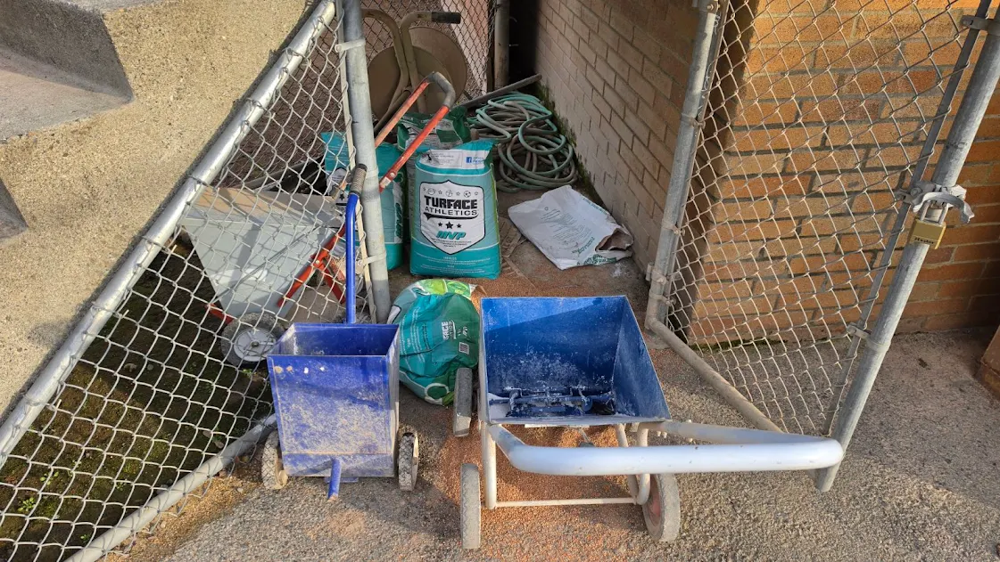
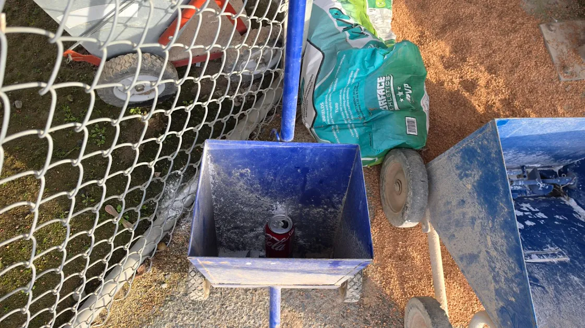
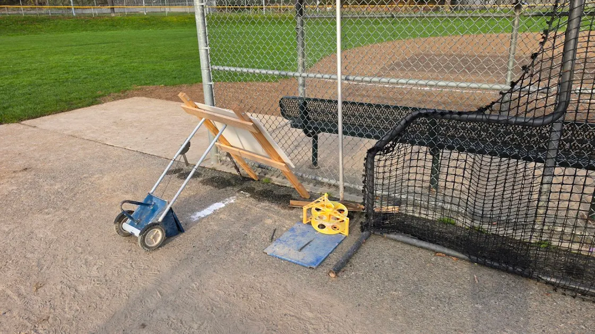
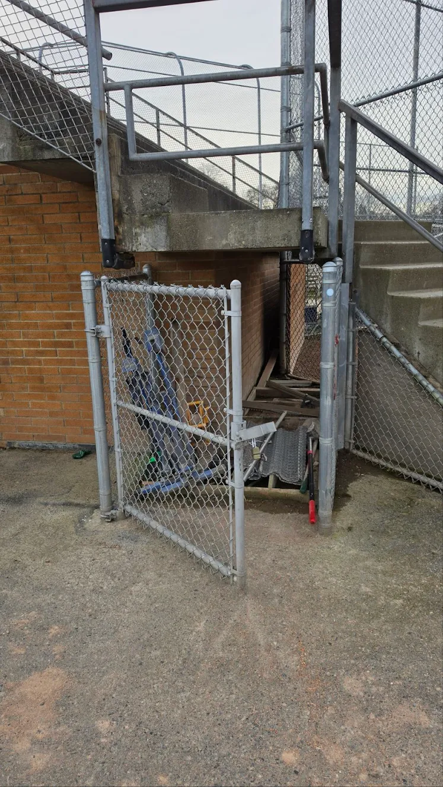
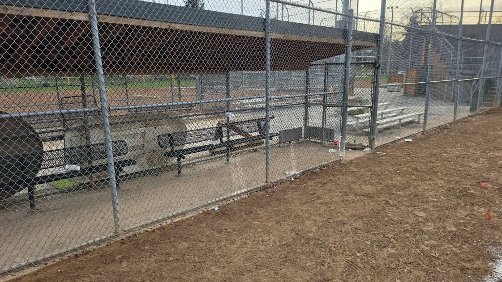
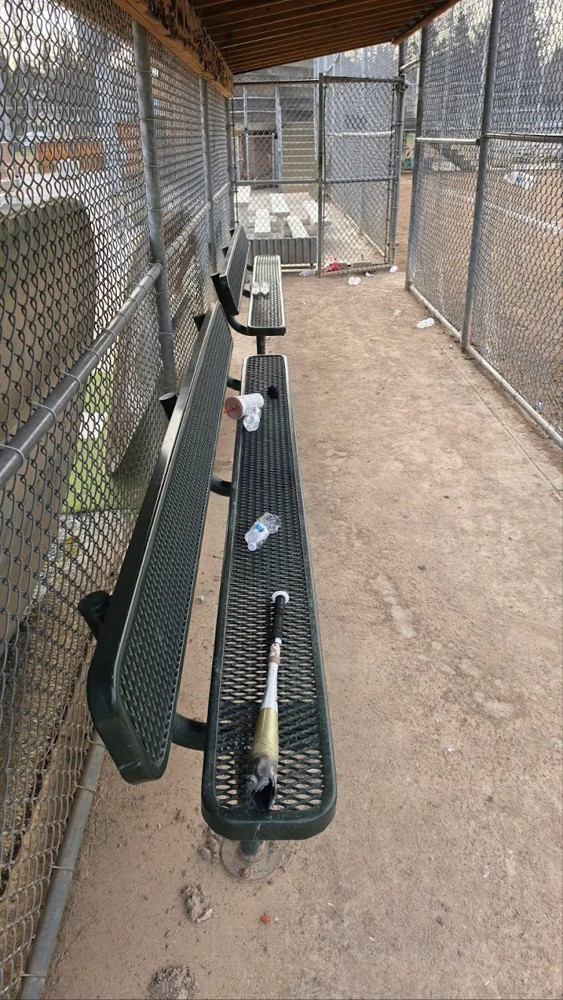
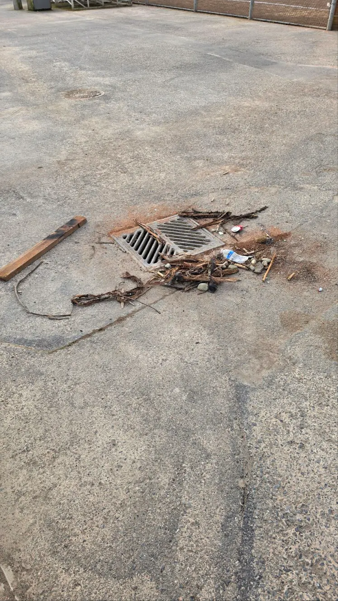
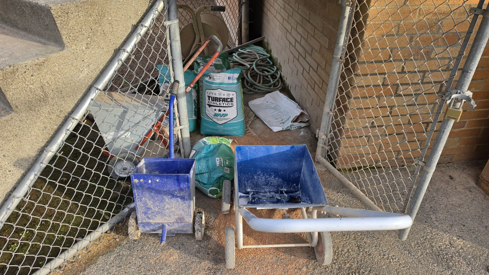

# NCLL LW Ground Gremlins

> **Flash-mob field crew that swoops in after rain to keep diamonds playable.**

Welcome to the Ground Gremlins Space — real-time coordination for anyone keeping Lower Woodland fields 3, 4, 5, and 6 alive through the Seattle spring.

**👉 [Join the NCLL LW Ground Gremlins Platoon to join the team!](https://chat.google.com/room/AAQAHA6KIpE?cls=7)**

## How to Join the Space

1. **Tap or click the link above** on your phone or computer — it will open Google Chat.
2. If prompted, **sign in with your Google account** (Gmail, Google Workspace, etc.).
3. You should see a screen for the "NCLL LW Ground Gremlins" space — tap **Join**.
4. If the link opens Google Chat but doesn't land on the Space, try **copying and pasting the link directly into your browser**.
5. On mobile, make sure the **Google Chat app is installed** — the link works best through the app rather than a browser.

> **Heads up:** Google Chat Space links can be a little finicky — don't give up if it doesn't work on the first try. Persistence always pays off, and if you're still stuck just reach out at [registrar@ncllball.com](mailto:registrar@ncllball.com) and we'll get you added manually.

---

## What Is the Ground Gremlins Platoon?

| | |
| --- | --- |
| **Purpose** | Rapid-response field work when weather hits |
| **What you'll do** | Rake, broom, sponge, lay Turface, clear drains |
| **Callouts** | Google Chat Space for urgent needs and weekend planning |
| **Best for** | Parents near Lower Woodland or anyone who can jump in on short notice |
| **Frequency** | Only when needed — rain days |

This Space is where we share Friday field condition reports, coordinate work parties, and keep everyone — coaches and Gremlins alike — on the same page. Tyler monitors it and pushes updates as conditions change.

Once you're in, here's everything you need to know about keeping these fields playable.

---

---

## The Fields: What You're Working With

We primarily use Lower Woodland Fields 3, 4, 5, and 6. They are not equal.

**Field 3** drains the best and is usually the easiest to save after rain. Start here if you're triaging.

**Field 4** has chronic problem areas at first base and near home plate. Manageable with attention.

**Fields 5 and 6** need extra love — and prayers. These fields hold water and require the most work. If you're on 5 or 6 and it's been raining, plan to get there early.

---

## Our Relationship with Seattle Parks — Don't Blow It

Seattle Parks has been a genuinely good partner to this league. They regularly defer to our officials once games are underway, they bring Turface when we ask, and they've worked with us through tough springs. That trust was earned over many seasons and it is not guaranteed.

**Every time a coach uses a closed field, leaves ruts, or trashes a dugout, it puts that relationship at risk — for every team in the league.**

When Parks sees coaches out early working a wet field, raking, removing water, doing the unglamorous stuff — they notice. They show up with product. They open fields they might otherwise have kept closed. That goodwill is worth more than any single practice.

---

## Before You Take the Field: The Basics

### If the Parks Department Has Closed the Field
Don't practice on the dirt. Full stop.

A closed field means the dirt is saturated. Using it leaves ruts and marks that damage the surface for days. One practice on a closed field can cost the league a formal complaint.

**What you CAN do on a closed field:**
- Use the grass for warmups, conditioning, and drills. If it's not actively raining, the outfield grass is usually fine.
- Better yet — work the field. Rake it, remove puddles, prep it for the weekend. You'll be a hero to every team with a Saturday game.

### Leave It Better Than You Found It
When your practice or game ends, do a full walk of the field and dugout.

- **Lock the mound cage.** Always. Chalkers, mounds, rakes, chalk, string — all of it goes back inside and the cage gets locked.
- **Pick up your dugout.** Water bottles, wrappers, bats left on the bench — take it with you or put it in a trash can. Other teams use these dugouts.
- **Don't leave things "just outside" the cage.** If it's not locked up, it walks away or gets left out in the rain.

The photos below are from a recent morning walk of the fields. This is what we're working against — and all of it is preventable.

---

## Wet Weather Protocol

### The Friday Push

Friday afternoon is your window. Rain Saturday morning is manageable if Friday evening prep goes well. Rain all night with no prep Friday is very hard to overcome.

**The goal:** get water off the dirt, scratch the surface, let wind and overnight air do the work.

A few coaches and a handful of parents working for 60–90 minutes on Friday can be the difference between a Saturday full of games and a full cancellation. Let Tyler know what you find when you get to your field. He can relay condition reports to the AAA and Majors coordinators so everyone can work together.

**Post your field photos here on Fridays.** Even a quick shot of the infield tells us a lot.

Here's what the fields looked like during a particularly rough stretch this spring:

---

## Working the Field — Step by Step

### Tools Available On-Site
Each field has a lock box with rakes, nails, string, chalk, and a chalker. The mound cage holds the pitching mounds, additional rakes, and Turface/Diamond Dry. **You need the cage combo to access product — get it from your division coordinator before the season.**

It's also worth keeping a garden rake in your car. The lock box rakes are shared and sometimes missing.

### A Note on "Scratching" the Field

Throughout this guide you'll see references to **scratching** the dirt. This simply means dragging a rake across the surface with enough pressure to break through the crust and turn the top layer of soil over — similar to what a nail drag does on a professional field. You're not smoothing it; you're roughing it up intentionally. Breaking up the surface also dramatically increases the exposed surface area of the soil, which means more contact with air and wind. The exposed, loosened soil dries out faster, absorbs rain better, and gives water somewhere to go other than the surface. Think of it as aerating a lawn, but with a rake and some elbow grease.

### Scenario 1: Field Is Relatively Dry on Friday Night
This is the best case. The field doesn't need saving — it needs prep.

1. **Scratch the entire surface** with the large field rake or a garden rake. You're turning the soil over, breaking up compaction, and opening up air pockets. The goal is for overnight rain to absorb rather than puddle.
2. **Level the dirt.** Bring material from high spots to low spots — not the other way. The most common mistake people make when fixing a wet field is pushing puddles outward, which pulls dirt from the low areas (home plate, in front of the mound, first base path) and deposits it at the edges. Then nobody ever brings it back. Over time the low spots get lower and hold more water. When the dirt is dry or just damp, that's your chance to fix it.
3. **Fill the holes.** Especially at home plate, the pitcher's landing spot, and the first/third base cutouts.

### Scenario 2: Field Is Wet Friday Night, Light Rain Expected Overnight

1. **Remove all standing water first.** Shop-vac, buckets, or spreading with a rake or push broom into the grass. Do not skip this step and go straight to product — it doesn't work.
2. **Scratch the surface** to ½ inch depth after removing water. Turn the dirt, leave the scratch marks exposed. The combination of scratched soil and overnight wind is remarkably effective.
3. **DO NOT apply Turface or Diamond Dry the night before a game.** It wastes product that you'll need Saturday morning, and wet field + product overnight often makes things worse, not better. Save it.
4. **Check the radar.** Seriously. If it's going to pour all night, prioritize rest and get there early Saturday. You can't out-rake a night of heavy rain.

### Scenario 3: Saturday Morning Game-Day

Get to the field early. Tyler is regularly there by 7am when conditions are bad. You don't have to match that, but earlier is better.

1. Apply the same principles — scratch, remove water, level.
2. **45 minutes before game time**, start applying Turface and/or Diamond Dry to the wet spots: home plate area, pitcher's mound landing zone, first and third base paths, the outfield cutouts.
3. **Spread it while you walk.** Open the bag to about a 6"×6" hole, lift the bag, and pour while walking and swinging side to side. This distributes the product as you go rather than dumping it in one spot and raking it from there. Once it's down, use the rake to smooth and scratch it in.
4. If a Seattle Parks employee is on site, flag them down. Let them know you have games all day and ask if they can bring more Turface. They are often willing to help coaches who are visibly putting in work.

---

## Turface vs. Diamond Dry — Know the Difference

You'll hear these used interchangeably on baseball broadcasts. They are not the same thing.

**Diamond Dry** is chalky and powder-like. It is strictly a wet field management product — it absorbs surface moisture fast. It has no other use on a field.

**Turface** (the granular product, looks like kitty litter) is baked clay. It is the primary infield conditioner used on professional fields. It absorbs water *and* it improves the playing surface when the field is dry. It's the better all-purpose product.

**The rule:** Use Turface first. Fall back to Diamond Dry when you run low on Turface.

**The hard rule:** Do not dump either product directly into a standing puddle. It doesn't work. You'll waste product and still have a puddle. Remove the water, scratch the dirt, *then* apply the drying agent.

---

## Batting Practice and Drill Adjustments During Wet Conditions

When the fields are soft, normal practice habits cause outsized damage. Please make these adjustments:

**Batting Practice:** Move away from the cages. The turf directly in front of and behind the cages is taking a beating. If space allows, set up tee work or soft toss on the walking paths or on the deep outfield grass.

**Outfield Drills:** The grass along the foul lines is already worn thin. Run drills in deep center or along the outfield fence where the grass is holding up.

**Ground Ball Work:** Keep fielders off the wet spots and puddles. Beyond field damage, this is a safety issue — a bad hop off a saturated infield is a real injury risk.

---

## Striping the Foul Lines (When Parks Doesn't)

Parks doesn't always get to the lines before your game. You can do it yourself and it takes about 10 minutes.

**What you need:** Two nails and string from the lock box, a chalker.

**How to do it:**
1. Put one nail in the outfield grass on the foul side of any remaining paint, lined up with the foul line direction.
2. Put the second nail just beyond home plate, positioned so the string runs through the back point of home plate.
3. Pull the string taut. It should run right along the outer edge of first and third base.
4. Chalk on the **fair side** of the string (field side), directly beneath it, running from home plate through the base and out into the outfield.

Parks often doesn't stripe all the way into the outfield. If you notice the line gets angular out there, you can extend it yourself using the same nail-and-string method.

---

## Communication — How This Space Works

**Post here when:**
- You visit your field on a Friday and see conditions worth sharing (photos encouraged)
- You're organizing a work party and need help
- You have a question about whether a field is playable
- You want to flag something that needs Parks' attention

**Tyler will post here when:**
- Field status changes ahead of a weekend
- A work party is being organized
- There's a league-wide communication coaches need to know about

The more real-time information we share here, the better everyone's Saturday morning goes.

---

## Quick Reference Checklist

**Every practice/game — before you leave:**
- [ ] All equipment back in the mound cage and locked
- [ ] Chalkers, mounds, rakes, chalk, string — all inside
- [ ] Dugout cleared of trash, water bottles, equipment
- [ ] Report anything broken or missing to Tyler

**Friday before a rainy weekend:**
- [ ] Visit your field if you can
- [ ] Post a photo of conditions to this Space
- [ ] If wet: remove puddles, scratch the surface, do NOT apply product
- [ ] If dry/damp: scratch and level the dirt
- [ ] Check the overnight radar before you leave

**Saturday game morning:**
- [ ] Arrive early — 7am if conditions are bad
- [ ] Scratch, remove water, level
- [ ] Apply Turface/Diamond Dry 45 min before game time
- [ ] Talk to Parks staff if they're on site
- [ ] Be honest about whether the field can be saved

---

*Questions? Post here or contact Tyler directly. Let's have a great season.*

— Tyler Christofferson, NCLL Fields
