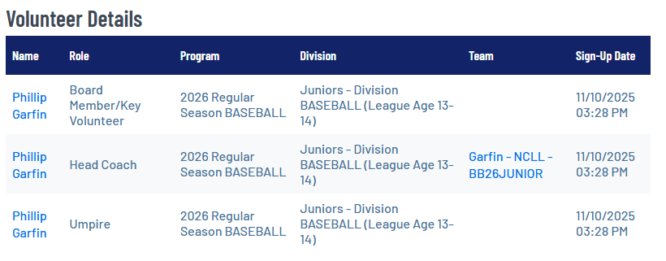
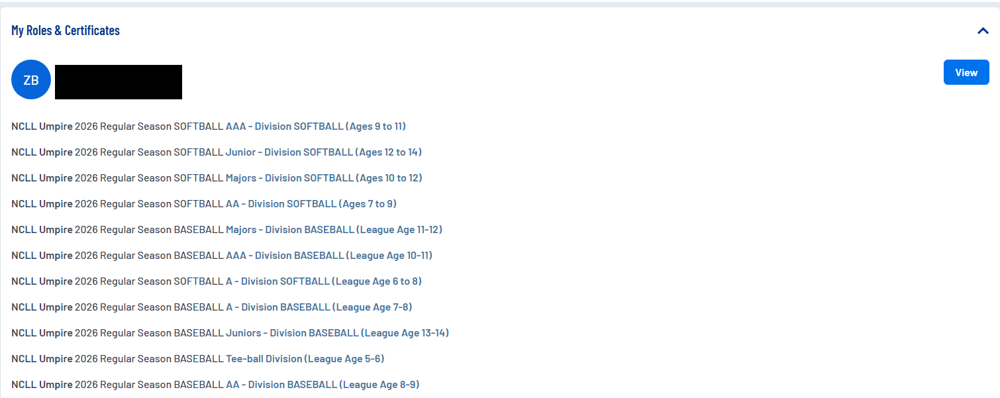
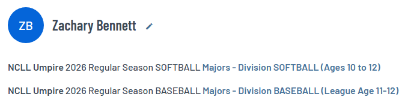

**Hello Umpire Registrants!**

I've been going through the umpire registrations and just wanted to point a few things out:

**1 - Volunteers are required to sign up for each volunteer role they undertake.**

If you've been allocated to a team under the umpire role, that was a mistake as umpires and board/key volunteers are NOT allocated to teams. If you've been allocated to a team in the umpire capacity, I have removed you from that team but your umpire registration remains valid and just as it should be.

For those who are volunteering in BOTH an umpire capacity AND Coach/Team Manager/Assistant Coach capacity, you need to have two separate registrations. 

This is what something like that should look like (I will assign you to the team):

If you are umpiring, volunteering as an assistant for your kids' A team and your other kids' AAA team, then you will need three separate registrations.

**Resolution**

Just sign up for another role as Coach/Team Manager/Assistant Coach capacity for each kids' team you want and I'll take it from there.

**2 - You only need to sign up for a single umpire role.**

The division you select DOES NOT matter and DOES NOT restrict you to games in that division — it's simply a registration quirk that requires an answer. Pick any division and move on. This would be incorrect. 

**Resolution**

I have removed many of these minor issues so I would like for everyone to check and make sure they like how their Volunteer registrations look.

**3 - If you plan to umpire in both Baseball and Softball, you must volunteer in both PROGRAMS.** 

Baseball and Softball are considered separate in Sports Connect. Zachary Bennett is perfectly aligned for that. 

**Resolution**

Sign up for both programs, Softball and Baseball.

**Finally**

Having a parent/guardian/etc. on your team who is also an umpire is a great thing for a coach as it takes something very important off their plate. I coached from tee-ball to Majors and I was blessed to have Eric Evans in this role and it's a big deal.

That parent/umpire/etc. can confirm the teams games are covered and attempt to get coverage if not. If this is the case, it sounds to me like you are an assistant coach in charge of umpiring for the team so sign up to be an assistant!

Thanks and please let me know any issues or questions you have!

John Shikella
Registrar/Information