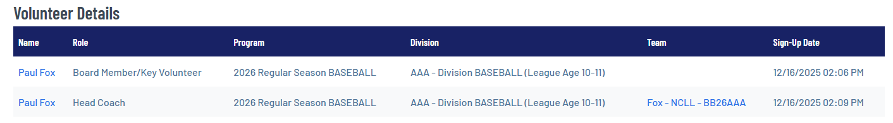

# 9's | 10's | 11's (OPEN)

| Round | Joseph Klarman       | Jay Miller         | Ian Hernandez        | Paul Fox           | Scott Walsworth  | Evan Cabodi            | Michael Fishback   | Austen Wiederspan  | Direction |
| ----- | -------------------- | ------------------ | -------------------- | ------------------ | ---------------- | ---------------------- | ------------------ | ------------------ | --------- |
| 1     | Dylan Tassos         | Malakai Montgomery | Ethan Traube         | Emmett Parsons     | Yuiya Kusunoki   | Maddox Baltazar        | Otis Fishback      | Jack Harrold       | --->      |
| 2     | Maxwell Fuste        | Ahaan Holenarsipur | Diego DeHerrera      | Riku Kojima        | Brady Avratin    | Levon Soderman         | Avery Lee          | Gabriel Wiederspan | <---      |
| 3     | Finnegan Millea      | Sam D'Amico        | Grayson Evanger      | Ryan Riley         | Henry Payne      | Omar Junejo            | Carson McKinnie    | Noah Harrold       | --->      |
| 4     | Oliver Parsons       | Rumi Zubair        | Emile Kruchoski      | Julian Fox         | Vaughn O'Rourke  | Miles Patterson        | Jameson Ginn       | Conor McMullen     | <---      |
| 5     | Golden Klarman       | Niam Gnaneswaran   | Mario Butorac        | Sebastian Ortega   | Tove Bennett     | Benjamin Graber        | Luke Haid          | Owen Tomascheski   | --->      |
| 6     | Emmett Gustafson     | Vytas Pachl        | Emmitt Crall         | Maxwell Robertazzi | Cormac Douglas   | Joseph Cabodi          | Cameron Ginsburgh  | Dylan Wade         | <---      |
| 7     | Henry Van Horne      | Ander Cheatham     | Conrad Timme         | James Solan        | Beckett Zastrow  | William Luthy          | Alexander Laughlin | Nicholas Zimcosky  | --->      |
| 8     | Vidal Naar           | Jonah Glatstein    | Marius Roger Lejeune | Smith Kensok       | Leo Collins      | Thorleif Westin-Davies | Theo Klarich       | Magnus Ishizaki    | <---      |
| 9     | Henry Kooy           | Peter Hofman       | John Howard          | Jordan Kaufman     | Sebastian McCabe | Hudson Dahl            | Rhett Fazio        | Eli Wiederspan     | --->      |
| 10    | Atlas Williams       | Harvey Rich        | John Flanzer         | Erik Aeder         | Owen O'Connor    | Luke Yokel             | Kalen Hatch        | Aidan Syed         | <---      |
| 11    | John Walter Williams | Tavin Miller       | Leo Shriner          | Remiel Lusby       | Milo Pahnke      | Maxwell Demas          | Oliver Kalapov     | Desmond Jonas      | --->      |
| 12    | Oliver Martynenko    | Ronan Berlin       | Robert Hernandez     | Ren Quiaoit        | Miles Walsworth  | Forest Sheppard        | Dylan Wu           | William Bibler     | <---      |

| Head Coach        | Assistant           | Assistant     |
| ----------------- | ------------------- | ------------- |
| Michael Fishback  | Danny Lee           |               |
| Evan Cabodi       | Derek Baltazar      |               |
| Ian Hernandez     | David Evanger       |               |
| Joseph Klarman    | Victor Fuste        | John Williams |
| Jay Miller        | Matthew Gnaneswaran |               |
| Scott Walsworth   | Katsuya Kusunoki    |               |
| Austen Wiederspan | Joe Tomascheki      |               |
| Paul Fox          | Cole Parsons        | David Ortega  |

| Incoming Transfers | From Division                                       |
| ------------------ | --------------------------------------------------- |
| Dylan Tassos       | AA                                                  |
| Malakai Montgomery | AA                                                  |
| Ahaan Holenarsipur | MAJ                                                 |
| Emmitt Crall       | MAJ                                                 |
| Emmett Parsons     | AA                                                  |
| Riku Kojima        | AA                                                  |
| Ryan Riley         | AA                                                  |
| Maxwell Robertazzi | AA                                                  |
| James Solan        | WAIT LIST - AA - Division BASEBALL (League Age 8-9) |
| Remiel Lusby       | AA                                                  |
| Yuiya Kusunoki     | AA                                                  |
| Vaughn O'Rourke    | AA                                                  |
| Benjamin Graber    | AA                                                  |
| Hudson Dahl        | AA                                                  |
| Luke Haid          | AA                                                  |
| Kalen Hatch        | AA                                                  |
| Gabriel Wiederspan | AA                                                  |
| Noah Harrold       | AA                                                  |
| Owen Tomascheski   | AA                                                  |
| Nicholas Zimcosky  | AA                                                  |

| Outgoing Transfers | To Division |
| ------------------ | ----------- |
| Gibson Arnette     | MAJ         |
| Anders Lawrence    | AA          |
| Colin Carver       | AA          |
| Leo Fuld           | AA          |
| Louie Taverniti    | AA          |

| Coaches not yet registered | Status                                                                                               |
| -------------------------- | ---------------------------------------------------------------------------------------------------- |
| Austen Wiederspan          | not signed up                                                                                        |
| Katsuya Kusunoki           | will transfer with player (Yuiya Kusunoki)                                                           |
| Joe Tomascheki             | will transfer with player (Owen Tomascheski)                                                         |
| Cole Parsons               | will transfer with player (Emmett Parsons) \*\* Cole needs to sign up for coaching role -- see below |

| Team Names                  |
| --------------------------- |
| Fishback - NCLL - BB26AAA   |
| Cabodi - NCLL - BB26AAA     |
| Hernandez - NCLL - BB26AAA  |
| Klarman - NCLL - BB26AAA    |
| Miller - NCLL - BB26AAA     |
| Walsworth - NCLL - BB26AAA  |
| Wiederspan - NCLL - BB26AAA |
| Fox - NCLL - BB26AAA        |

This is how we sign up for multiple roles: 

Sign up:

1. Austen Wiederspan sign up for head coach
2. Cole Parsons sign up for AAA assistant coach

Umpires who need to sign up to assistant coach if they plan to do that: (They are currently only signed up as UMPS)

1. Matt Collins is an umpire and assistant coach
2. Cody Harrold is an umpire and assistant coach

There are 5 leftover kids in AAA. These guys are not on a team. I assume they are headed to AA.

1. Anders Lawrence
2. Colin Carver
3. Leo Fuld
4. Louie Taverniti
5. Gibson Arnette
