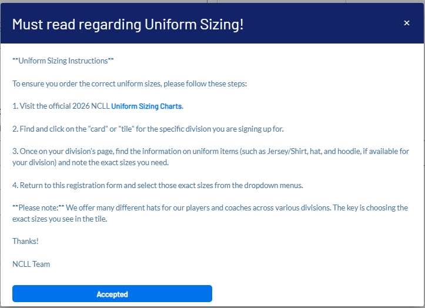

# Juniors Uniform Update — Garfin Team (BB26JUNIOR)

---

## Two Things to Know

### 1. Hoodie Sizing

For some divisions, Chris ordered hoodies one size up from the jersey/shirt size submitted at registration. For example, if you ordered a **Large** shirt, an **XL** hoodie may have been ordered on your behalf. It's not confirmed whether this was done for Juniors specifically, but it was done for several other divisions — so heads up.

### 2. Hat Size — Adult Adjustable Strap

Some Juniors families selected **"Adult adjustable strap"** for hat size during registration. This happened because the registration system (SportsConnect) does not allow us to present different size options to different divisions — so the hat size dropdown is shared across all divisions and includes that option.

**However, the adult adjustable strap is not available for Juniors hats.**

The image below is exactly what was presented to families during registration — the instructions were clear, and parents checked a box confirming they had read them. Those who selected "Adult adjustable strap" did not follow the instructions they agreed to.

👉 [NCLL Uniforms Page](https://www.ncllball.com/Default.aspx?tabid=2113971)

So if the registration shows "Adult adjustable strap" for hat size, have them get their hats last as it's not fair to those who read the instructions.

---

## Team context (no roster)

**Program:** 2026 Regular Season Baseball  
**Division:** Juniors (League Age 13–14)  
**Team:** Garfin — BB26JUNIOR  

Roster exports with names, emails, or phone numbers must not be stored in this public repository. Use SportsConnect, team channels, or other private league tools for distribution.
