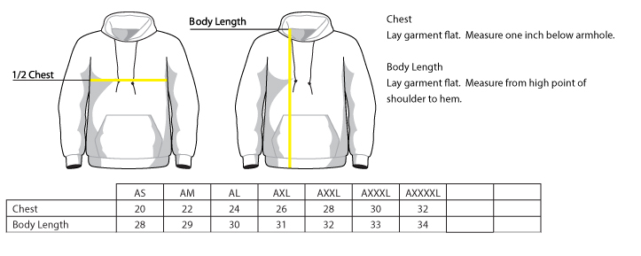
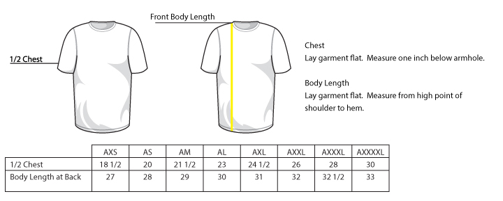
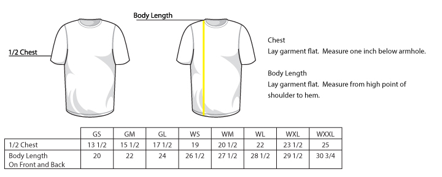

# PLAYERS HATS & SHIRTS MODEL CHART

| Program/Division   | Hat Model #      | Shirt Model # | Hoodie Model # | Socks | Belt |
| ------------------ | ---------------- | ------------- | -------------- | ----- | ---- |
| Baseball - T-Ball  | 4301             | ST350         | none           | OSFA  | OSFA |
| Baseball - Kindy   | 4301             | ST350         | none           | OSFA  | OSFA |
| Baseball - A       | 4301             | 4003          | none           | OSFA  | OSFA |
| Baseball - AA      | 4301             | 4003          | none           | OSFA  | OSFA |
| Baseball - AAA     | Richardson PTS30 | 4003          | PC90H          | OSFA  | OSFA |
| Baseball - Majors  | Richardson PTS30 | 4003          | PC90H          | OSFA  | OSFA |
| Baseball - Juniors | Richardson PTS30 | 4003          | PC90H          | OSFA  | OSFA |
| Baseball - Seniors | Richardson PTS30 | 4003          | PC90H          | OSFA  | OSFA |
| Softball - A       | 4302             | 4408          | none           | OSFA  | OSFA |
| Softball - AA      | 4302             | 4408          | none           | OSFA  | OSFA |
| Softball - AAA     | 4302             | 4408          | PC90H          | OSFA  | OSFA |
| Softball - Majors  | 4302             | 4408          | PC90H          | OSFA  | OSFA |
| Softball - Juniors | 4302             | 4408          | PC90H          | OSFA  | OSFA |
| Softball - Seniors | 4302             | 4408          | PC90H          | OSFA  | OSFA |

# COACHES HATS & SHIRTS MODEL CHART

| Program/Division         | Hat Model #      | Shirt Model # | Hoodie Model # | Socks | Belt |
| -------------------------- | ---------------- | ------------- | -------------- | ----- | ---- |
| Baseball - T-Ball Coaches  | 4301             | ST350         | none           | none  | none |
| Baseball - Kindy Coaches   | 4301             | ST350         | none           | none  | none |
| Baseball - A Coaches       | 4301             | ST350         | none           | none  | none |
| Baseball - AA Coaches      | 4301             | ST350         | none           | none  | none |
| Baseball - AAA Coaches     | Richardson PTS30 | ST350/ST550   | PC90H          | none  | none |
| Baseball - Majors Coaches  | Richardson PTS30 | ST350/ST550   | PC90H          | none  | none |
| Baseball - Juniors Coaches | Richardson PTS30 | ST350/ST550   | PC90H          | none  | none |
| Baseball - Seniors Coaches | Richardson PTS30 | ST350/ST550   | PC90H          | none  | none |
| Softball - A Coaches       | Champro HC10     | 4408          | none           | none  | none |
| Softball - AA Coaches      | Champro HC10     | 4408          | none           | none  | none |
| Softball - AAA Coaches     | Champro HC10     | ST350/ST550   | PC90H          | none  | none |
| Softball - Majors Coaches  | Champro HC10     | ST350/ST550   | PC90H          | none  | none |
| Softball - Juniors Coaches | Champro HC10     | ST350/ST550   | PC90H          | none  | none |
| Softball - Seniors Coaches | Champro HC10     | ST350/ST550   | PC90H          | none  | none |

# SIZE & LENGTH CARDS

## Legend — measurement conventions

- Pit-to-pit (PTP): the flat measurement taken straight across the front of the garment, from one armpit seam to the other. This is a "diameter"-style measurement and is expressed in inches.
- Circumference (CIRC): the full chest circumference — equal to 2 × Pit-to-pit. We prefer using pit-to-pit (PTP) on NCLL because it's the direct flat measurement used for sizing and easier to compare between suppliers.
- Body Length: measured from the highest point at the back (or front when noted) to the hem, expressed in inches.

Notes:
- Where a table column is labelled "1/2 Chest" or "Chest" in the original supplier sheet, we treat that value as pit-to-pit (PTP) for the normalized table below. If you have supplier sheets where "Chest" is a circumference, tell me and I will convert by dividing the circumference by 2.
- All normalized tables below explicitly show Pit-to-pit (PTP) values so you can use them consistently when ordering.

Size codes (master): YS = Youth Small; YM = Youth Medium; YL = Youth Large; GS = Girl Small; GM = Girl Medium; GL = Girl Large; WS = Women's Small; WM = Women's Medium; WL = Women's Large; WXL = Women's X-Large; WXXL = Women's 2X-Large; AXS = Adult X-Small; AS = Adult Small; AM = Adult Medium; AL = Adult Large; AXL = Adult X-Large; AXXL = Adult 2X-Large; AXXXL = Adult 3X-Large; AXXXXL = Adult 4X-Large

Size,Chest,Body Length
AS,20,28
AM,22,29
AL,24,30
AXL,26,31
AXXL,28,32
AXXXL,30,33
AXXXXL,32,34
 
### PC90H — Normalized (Pit-to-pit)

Size codes: AS = Adult Small, AM = Adult Medium, AL = Adult Large, AXL = Adult X-Large, AXXL = Adult 2X-Large, AXXXL = Adult 3X-Large, AXXXXL = Adult 4X-Large

Size,Pit-to-pit (in),Body Length (in)
AS,20,28
AM,22,29
AL,24,30
AXL,26,31
AXXL,28,32
AXXXL,30,33
AXXXXL,32,34

Size,1/2 Chest,Body Length at Back
AXS,18 1/2,27
AS,20,28
AM,21 1/2,29
AL,23,30
AXL,24 1/2,31
AXXL,26,32
AXXXL,28,32 1/2
AXXXXL,30,33
 
### ST350 — Normalized (Pit-to-pit)

Size codes: AXS = Adult X-Small, AS = Adult Small, AM = Adult Medium, AL = Adult Large, AXL = Adult X-Large, AXXL = Adult 2X-Large, AXXXL = Adult 3X-Large, AXXXXL = Adult 4X-Large

Size,Pit-to-pit (in),Body Length at Back (in)
AXS,18.5,27
AS,20,28
AM,21.5,29
AL,23,30
AXL,24.5,31
AXXL,26,32
AXXXL,28,32.5
AXXXXL,30,33

Size,1/2 Chest,Body Length at Back
AXS,18 1/2,27
AS,20,28
AM,21 1/2,29
AL,23,30
AXL,24 1/2,31
AXXL,26,32
AXXXL,28,32 1/2
AXXXXL,30,33
 
### ST550 — Normalized (Pit-to-pit)

Size codes: AXS = Adult X-Small, AS = Adult Small, AM = Adult Medium, AL = Adult Large, AXL = Adult X-Large, AXXL = Adult 2X-Large, AXXXL = Adult 3X-Large, AXXXXL = Adult 4X-Large

Size,Pit-to-pit (in),Body Length at Back (in)
AXS,18.5,27
AS,20,28
AM,21.5,29
AL,23,30
AXL,24.5,31
AXXL,26,32
AXXXL,28,32.5
AXXXXL,30,33

Size,1/2 Chest,Body Length On Front and Back
GS,13 1/2,20
GM,15 1/2,22
GL,17 1/2,24
WS,19,26 1/2
WM,20 1/2,27 1/2
WL,22,28 1/2
WXL,23 1/2,29 1/2
WXXL,25,30 3/4
 
### 4408 — Normalized (Pit-to-pit)

Size codes: GS = Girl Small, GM = Girl Medium, GL = Girl Large; WS = Women's Small, WM = Women's Medium, WL = Women's Large, WXL = Women's X-Large, WXXL = Women's 2X-Large

Size,Pit-to-pit (in),Body Length (in)
GS,13.5,20
GM,15.5,22
GL,17.5,24
WS,19,26.5
WM,20.5,27.5
WL,22,28.5
WXL,23.5,29.5
WXXL,25,30.75

Size,Youth/Men's Individual Chest Size
YOUTH SMALL,24"-26"
YOUTH MEDIUM,26"-28"
YOUTH LARGE,30"-32"
ADULT SMALL,34"-36"
ADULT MEDIUM,38"-40"
ADULT LARGE,42"-44"
ADULT X-LARGE,46"-48"
ADULT 2X-LARGE,50"-52"
ADULT 3X-LARGE,54"-56"

### 4003 — Normalized (Pit-to-pit)

Size codes: YS = Youth Small, YM = Youth Medium, YL = Youth Large; AS = Adult Small, AM = Adult Medium, AL = Adult Large, AXL = Adult X-Large; AXXL = Adult 2X-Large, AXXXL = Adult 3X-Large

Size,Pit-to-pit (in)
YS,12-13
YM,13-14
YL,15-16
AS,17-18
AM,19-20
AL,21-22
AXL,23-24
AXXL,25-26
AXXXL,27-28

HAT SIZE CHART PTS30
,YOUTH,XS-SM,SM-MD,LG-XL
SIZE,6 3/8′′−6 5/8′′,6 5/8′′−7′′,7′−7 1/4′′,7 3/8′′−7 5/8′′

HAT SIZE CHART 4301
,YOUTH,SM-MD,LG-XL
SIZE,6 3/8′−6 7/8′′,6 7/8′′−7 3/8′′,7 3/8′′−8′′

### Normalized hat charts (head circumference)

Note: hat supplier sheets list head circumference ranges. Below are normalized, decimal-inch ranges for each hat model to make comparisons consistent across vendors. The original supplier charts are preserved below for traceability.

HAT SIZE CHART PTS30 — Normalized (Head circumference, in)
| Size label | Head circumference (in) |
|---|---:|
| Youth | 6 3/8–6 5/8 |
| XS–SM | 6 5/8–7 |
| SM–MD | 7–7 1/4 |
| LG–XL | 7 3/8–7 5/8 |

HAT SIZE CHART 4301 — Normalized (Head circumference, in)
| Size label | Head circumference (in) |
|---|---:|
| Youth | 6 3/8–6 7/8 |
| SM–MD | 6 7/8–7 3/8 |
| LG–XL | 7 3/8–8 |

HAT SIZE CHART 4302 — Normalized (Head circumference, in)
| Size label | Head circumference (in) |
|---|---:|
| Youth | 6 3/8–7 1/4 |
| Adult | 7–7 3/4 |

HAT SIZE CHART HC10 — Normalized (Head circumference, in)
| Size label | Head circumference (in) |
|---|---:|
| Small | 6 1/4–7 |
| M–XL | 7–7 5/8 |
