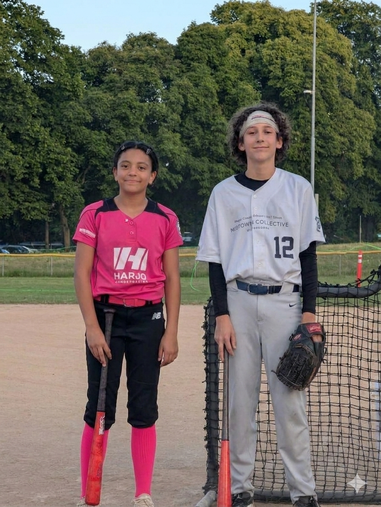

These are the pcitrues from the home run derby the other night. 

                 

Between a rotator pic and an aritcle, I want to highlight 4 things:

- baseball group
- softball group
- softball and baseball winners
- we had our first mother pitcher for baseabll ever. it usually goes to a coach or father. we like this. 

the baseball players from left to right: (insert below when you do it)
- can be found in the google space Home Run Derby Contest

the softball players from left to right: (insert below when you do it)
- can be found in the google space Home Run Derby Contest

  I want to do a rotator pic using canva. look at hte measurements and note the length and width of anything named rotator anywhere. 
  
  i want an image of the girls, the boys, the winners, and one of the mother/son duo. 